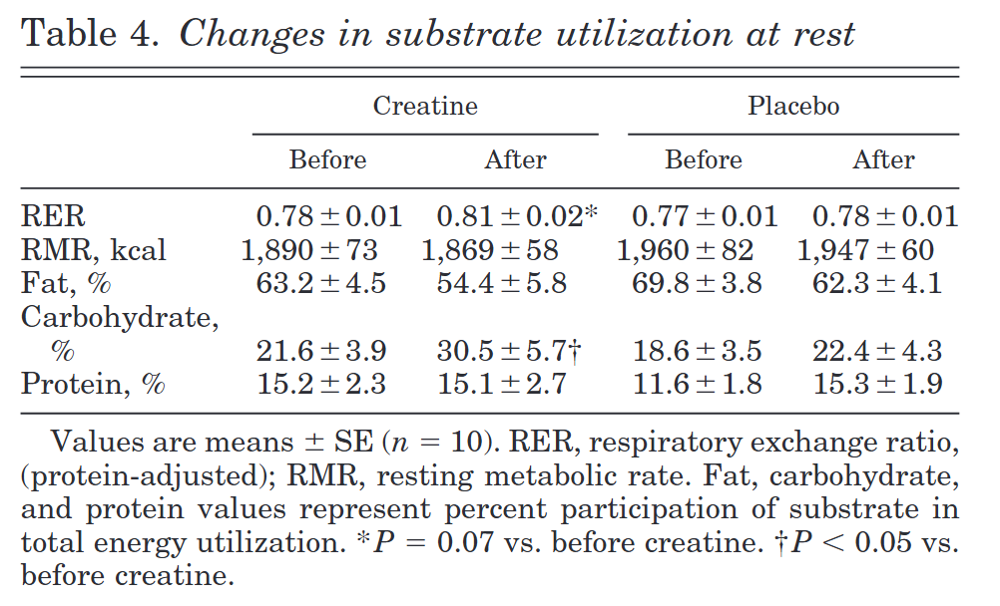
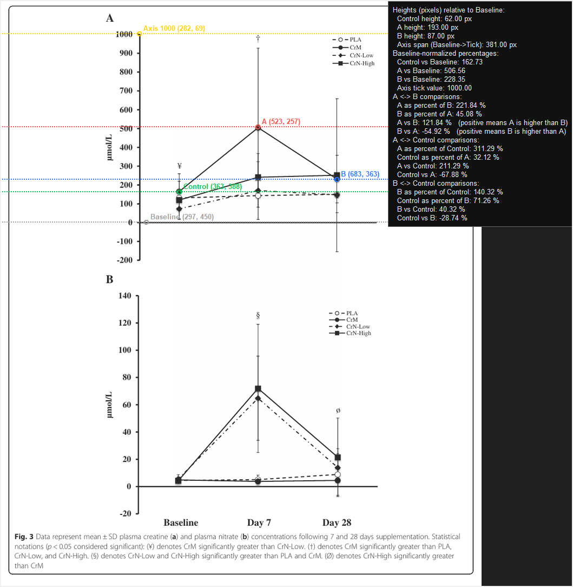

# Scientific_Paper_Graph_Comparison_Tool

I wanted a fast, repeatable way to compare bars or markers in figures without eyeballing them. This tool freezes your screens, lets you select a region of interest, and then measures heights relative to a baseline so you can compare Control vs Treatment on a percentage basis with clear, reproducible numbers.

------------------------------------------------------------------------

## What it does

-   Capture all monitors into one image, or open a file from disk.

-   Select a Region of Interest that can span across monitors.

-   Place four analysis points: **Baseline**, **Control**, **A**, **B**.

-   Optional calibration: place an **Axis** tick (for example the 100 percent line) and enter its numeric value.

-   Draw horizontal dotted guides at each point with color coding:

    -   Baseline: gray

    -   Control: green

    -   A: red

    -   B: blue

    -   Axis: gold

-   Always-on overlay in the upper right that fills progressively with results. Missing values show as `NA`.

-   Save exactly what you see. The Save button captures the current canvas view without gaps.




|              | Raw   | Calc              |
|--------------|-------|-------------------|
| Fat          | 63.04 | 63.04             |
| Carbohydrate | 84.3  | 84.3-63.04 =21.26 |
| Protein      | 100   | 100-84.3 =15.7    |

The above images are taken from:

[Creatine supplementation influences substrate utilization at rest](https://journals.physiology.org/doi/abs/10.1152/japplphysiol.01170.2001)

M. Erik Huso, Jeffrey S Hampl, Carol S. Johnston, and Pamela D. Swan

Journal of Applied Physiology 2002 93:6, 2018-2022

*Note that you have to do some math to make sense of the stacked bar chart. When comparing multiple bar charts it works marginally better, but I'm not gonna make it more convoluted than it already is(at least for now).*

------------------------------------------------------------------------

## Requirements

-   Python 3.8 or later

-   Packages:

    -   `` `pillow` ``

    -   `` `mss` ``

-   Tkinter is required. It ships with most Python installers on Windows and many Linux distros. If you built Python from source, ensure Tk support is enabled.

Install packages:

``` bash
pip install pillow mss
```

macOS users: grant screen recording permissions to the Python app you use to run the script so screen capture works.

## Quick start

1.  Download the script: `sci_viz_tool.py`

2.  Run it:

```         
python sci_viz_tool.py
```

3.  Click **Capture All Monitors** or **Open Image**.

4.  Optional: click **Select ROI**, then drag a rectangle over the plot area you care about.

5.  Click **Set Baseline** and click the chart baseline (usually the zero line).

6.  Optional but recommended for percent charts: click **Set Axis 100%**, enter a value (default 100), then click the 100 percent tick line.

7.  Click **Set Control**, **Set Marker A**, and **Set Marker B** at the tops of the bars or markers you want to compare.

8.  Read the overlay in the upper right.

9.  Click **Save Annotated** to export exactly what you see.

------------------------------------------------------------------------

## Keyboard shortcuts

-   `r` Select ROI

-   `d` Reset to Full Capture

-   `x` Clear Marks

-   `z` Set Baseline

-   `c` Set Control

-   `a` Set Marker A

-   `b` Set Marker B

-   `t` Set Axis 100% (calibration)

-   `Esc` Cancel current mode

------------------------------------------------------------------------

## How measurements work

### Coordinate model

-   You work on an image. This can be a frozen multi-monitor capture or any image you opened.

-   The canvas displays a scaled copy. Clicks on the canvas are mapped back to image coordinates.

### Heights

-   Heights are measured in pixels relative to **Baseline**.

-   If `baseline_y` is the y coordinate of Baseline and `top_y` is the y coordinate of a bar top, then\
    `height_px = baseline_y - top_y`.

### Pairwise comparisons

The overlay reports:

-   A as percent of B, B as percent of A

-   A vs B delta percent (positive means A is higher than B)

-   A vs Control and B vs Control in both directions

Formulas are simple ratios.

Example:

`A as percent of B = 100 * (height_A / height_B)`

`A vs B delta %     = 100 * (height_A - height_B) / height_B`

### Baseline-normalized percentages (calibration)

If you set **Axis** at a known tick (for example 100) the tool reports calibrated values:

`Calibrated(A) = (height_A / span) * AxisValue`

`span = baseline_y - axis_y`

If `span` is missing or equals `0`, the tool automatically scales to avoid division by zero by using:

`span_auto = max( height_A, height_B, height_Control )  or  1 px if none exist`

The overlay will show `Axis span (Baseline->Tick) (auto): ...` to indicate that auto scale was used. This lets you validate against percentage charts even when you do not set Axis, and it prevents crashes if Axis equals Baseline.

------------------------------------------------------------------------

## Typical workflows

### Compare two treatments against a control

1.  Set Baseline on the zero line.

2.  Set Control on your control bar top.

3.  Set A and B on treatment bars.

4.  Read A vs Control, B vs Control, and A vs B.

### Validate against a stacked percent chart

1.  Set Baseline on 0 percent.

2.  Set Axis 100% on the 100 percent grid line and keep the default value 100.

3.  Set bar tops for Control, A, and B.

4.  Read the Baseline-normalized percentages and verify against the y-axis labels.

------------------------------------------------------------------------

## Region of Interest and multi-monitor notes

-   **Capture All Monitors** uses `mss.monitors[0]`, which spans all attached displays.

-   **Select ROI** crops the working image. After cropping, previously placed points are cleared because their coordinates no longer match the new image.

-   You can always **Reset to Full Capture** to return to the original multi-monitor image.

------------------------------------------------------------------------

## Output

-   **Save Annotated** captures the canvas region of the screen and writes a PNG.

-   The image contains your ROI, horizontal guides, point labels, and the overlay panel.

-   There is no extra padding, so what you see is what you get.

------------------------------------------------------------------------

## Troubleshooting

-   **Nothing captures on macOS**\
    Grant Screen Recording permission to your Python interpreter in System Settings. If you switch interpreters or IDEs, you may need to grant the new one as well.

-   **Overlay shows NA everywhere**\
    Set Baseline first. Then set the bars you want to compare. The overlay fills progressively as soon as the required points exist.

-   **Axis span is NA or shows (auto)**\
    Either set Axis at a known tick or let the tool auto-scale. Auto-scale uses the largest available bar height so percentages remain defined.

-   **Lines look jagged after resize**\
    That is only the display scale. Saving the annotated view captures the canvas as rendered, so you will get exactly what you see.

-   **I clicked the wrong place**\
    Click the same button again and re-click the correct location. Use **Clear Marks** to remove everything.

-   **Some other issue**

    Yell at me on here or some other social media.

------------------------------------------------------------------------

## Design choices

-   Horizontal guides instead of verticals because height is the thing being measured.

-   Always-visible overlay with progressive NA fills to support partial workflows, for example Baseline plus Control only.

-   Save uses a screen grab of the canvas, not a re-render, to match the on-screen overlay exactly.

-   The whole thought came about while writing something up about the attenuation of hypervitaminosis A in relation to taurine supplementation. I got really annoyed that the authors only included tables and no actual data in their publication. I have seen this a lot in bio based disciplines and moreso in papers before the 2000s. I made this tool for myself and figured I'd get it out on github on the off chance it helps someone else.

------------------------------------------------------------------------

## Roadmap

*Or things that will definitely not happen. A wishlist to Santa Claus if you will. Much of this is easily doable, but the simple implementation I have right now works for my writing/research.*

-   Optional second tick so you can set two arbitrary y-axis values and infer both scale and offset.

-   CSV export of raw pixel heights and computed metrics.

-   Per-figure presets for color themes.

-   Snap-to-grid assist for noisy scans.

------------------------------------------------------------------------

## License

GPL 3.0 or later

------------------------------------------------------------------------

## Contributing

Bug reports and pull requests are welcome. If you find a figure that breaks the assumptions, include the screenshot and the steps you took to reproduce.

------------------------------------------------------------------------

## Changelog (high level)

-   v6: Baseline-normalized percentages, Axis tick with numeric value, safe auto-scale when Axis span is zero or missing, overlay note for auto scale. Actually publish to github.

-   v5: Added optional Axis 100 percent calibration and overlay section for calibrated values.

-   v4: Save captures the exact canvas without gaps, overlay fills progressively with NA, horizontal guides and color scheme.

-   v3: Horizontal guides, overlay moved to upper right, color coding for Baseline, Control, A, B.

-   v2: Separated Baseline from Control, added A vs Control and B vs Control.

-   v1: Initial capture, ROI, and point placement prototype.

------------------------------------------------------------------------

## Acknowledgments

Thanks to the studies and figures that motivated building this tool. It exists so you do not have to trust your eyeballs. And markdown visual editor for making markdown so much easier..

------------------------------------------------------------------------

## More Use Cases

In searching for even more use cases I dove(dived? delved? leaped?) into more creatine research. Note the before/after values of adding the axis marker at 1000, it allows for rough estimation of the values without needing to consult a table(if its even available).

Before:


After:


This is a great use case since it will let you quickly eyeball a graph. Now we can do treatment at point A vs point B as in the below:



Now we have values for plasma creatine supplementing Creatine Monohydrate at Baseline, Day 7, and Day 28 and we can eyeball the numbers. I could in theory add ±SD to a future implementation to grab the relative SD using the error bars, but for now this is just a tool for me to have to avoid eyeballing.

For reference:

|          | Image Tool | Study       |
|----------|------------|-------------|
| Baseline | 162.73     | 165.2±94.4  |
| Day 7    | 506.56     | 504.9±422.8 |
| Day 28   | 228.35     | 231.2±126.1 |

Its close enough to get a rough percentage for sure, most especially when you are faced with a bunch of plots that have absolutely no table or the authors don't respond to your request for the raw data.

Study Reference(copied from the paper):

Elfego Galvan, Dillon K. Walker, Sunday Y. Simbo, Ryan Dalton, Kyle Levers, Abigail O’Connor, Chelsea Goodenough, Nicholas D. Barringer, Mike Greenwood, Christopher Rasmussen, Stephen B. Smith, Steven E. Riechman, James D. Fluckey, Peter S. Murano, Conrad P. Earnest & Richard B. Kreider (2016) Acute and chronic safety and efficacy of dose dependent creatine nitrate supplementation and exercise performance, Journal of the International Society of Sports Nutrition, 13:1, 12, DOI: 10.1186/s12970-016-0124-0